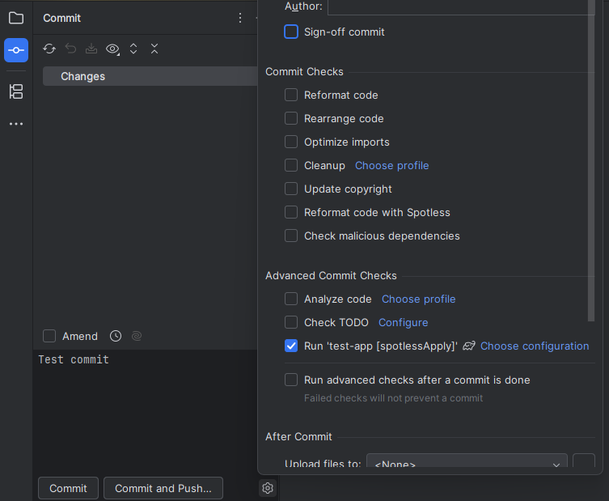

The IntelliJ IDEA 2025.1 release allows users to run any custom tool—such as the "spotlessApply" task—as a pre-commit
check via Run Configuration, making the old plugin-provided mechanism obsolete for both Maven and Gradle projects. Below
is a step-by-step guide to setting up Spotless as a pre-commit check in IntelliJ IDEA
2025.1.

## Guide: Configure Spotless Apply in IntelliJ IDEA 2025.1

Follow these steps to automate Spotless formatting on pre-commit using the IDE’s new built-in support.

### 1. Generate the Run Configuration

- Open the Gradle (or Maven) tool window in IntelliJ IDEA.
- Locate and run the `spotlessApply` task once (right-click the task and select "Run").
- This creates a reusable run configuration for `spotlessApply`.

### 2. Open Commit Options

- Go to the Commit window.
- Open commit options by pressing **Ctrl + O** (or use the interface menu).

### 3. Set Up Pre-Commit Check

- In the commit options, check the box for **Run Configuration**.
- From the dropdown, select the newly created `spotlessApply` configuration.

### 4. Disable Advanced After-Commit Checks

- Uncheck the option **Run advanced checks after a commit is done**. It is necessary to ensure that the Spotless task
  runs before the commit is finalized, so only properly formatted code gets committed.

***

With these steps completed, Spotless formatting will run automatically before every commit, ensuring consistent code
style for Maven and Gradle projects in IntelliJ IDEA 2025.1 and newer.

> [!NOTE]
> This pre-commit configuration can also be set globally in IntelliJ IDEA via the main Settings menu, or in "New Projects Setup" to apply the Spotless task for all new projects automatically. This eliminates the need to repeat setup for each individual project.
